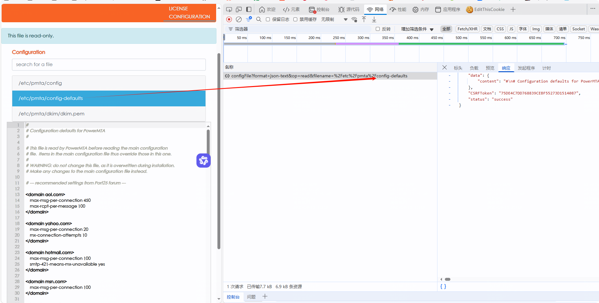
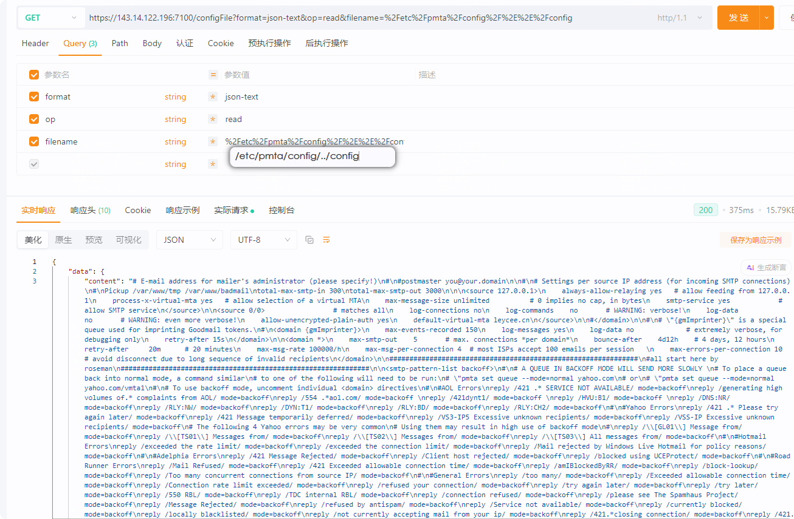
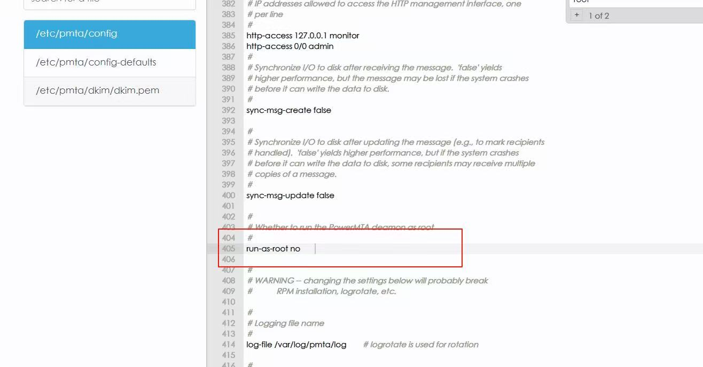

# Directory-Traversal-in-PowerMTA

## Directory Traversal in PowerMTA

In the Configuration page, it is possible to view some files of pmta.

 

After capturing packets and examining the request path, it was found to be an absolute path, and `../` can be used for directory traversal.

 

However, accessing other directories requires root user privileges.

In the configuration, change the permission to root user (yes).

 

Once the pmta service restarts, arbitrary file reading can be performed with root user privileges.

